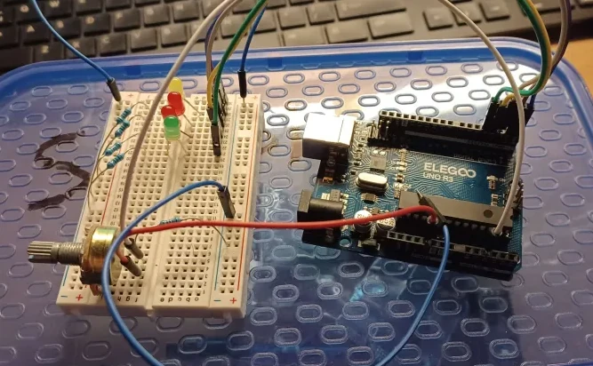
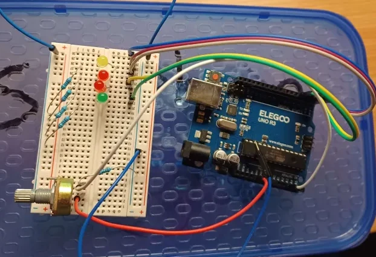

# Arduino AVR Runtime Environment

## What is it?
This project was originally an assignment for an embedded systems class. The assignment was originally suppose to be written in C/C++. But I felt that an extra challenge was needed, and decided to do this assignment from scratch using only AVR Assembly, without the help from any of the Arduino Libraries or the Arduino ARV Core. In order to achieve this project, The AVR interrupt table had to be written from scratch, neccissary interrupts had to be written from scratch, and it all had to be done in AVR Assembly code. And then finally flashed using [avrdude](https://github.com/avrdudes/avrdude).

This project was also my excuse to learn AVR assembly in the first place. The process of learning AVR assembly, learning the runtime and reset and interrupt behavior of the ATmega processor, and writing the runtime environment alongside the main program code for this assignment took about 5 days.

This runtime envrionment is reusable, and can be built upon by simply replacing the contents of the AVR functions `SETUP:` and `LOOP:` in the [text.asm](/text.asm) file with your own AVR assembly program.

### The current program
The current program that is running on-top of this runtime environment is the actual assignment. The task is to read analog input from a potentiometer, and then map and output that range to light up 4 individual led's to indicate the position of the knob.

Implementing this required interfacing with the Arduino's ADC hardware through the memory mapped IO registers.

Pictures of this are provided below, but unfortunately there is no video demonstrating the potentiometer program in action.

 

## Environment Features
Without the Arduino AVR Core to do all the hard stuff, such as setting up a clock, handling interrupts, and library implementations such as the 'delay()' function, this all has to be implemented manually from scratch. The features implemented so far include:

- Interrupt vector table.
- Macros to address a variety of neccissary memory mapped IO.
- Millisecond clock that can be used for delays and timers.
- Millisecond `DELAY:` function that puts the processor to sleep until the end of the delay.

### The timer interrupt and the clock
Many don't realize the neccissary scaffolding that the Arduino Core sets up and runs in the background in order to support the user environment for those writing programs in their IDE. One particular feature, the system clock, is vital to the operation of the `delay()` function and the `micros()` function. In order for these to work properly, Arduino sets up a timer interrupt before calling the user implemented `setup()` function. This timer interrupt is triggered approximately once per millisecond, which then increments the system clock. Without the Arduino AVR Core, my from-scratch AVR environment has to rely on it's own custom implementation of the system clock via the timer interrupts.

### C Preprocessor
In order to make up some of the deficits of the current AVR assembler, the code files are processed using GCC's C Preprocessor before assembling it to binary. As a result, the C preprocessor can be used within the assembly code files, and it is used to define all of the macros that address memory mapped IO.

## How to build
Note that the tools and scripts for building this project are intended to run on a Linux environment.

This runtime environment can be compiled for the ATmega324P/V, ATmega324P/V, ATmega324P/V, and the ATmega328P microprocessors.

### Tools needed
[GCC](https://gcc.gnu.org/) (used for the preprocessor) \
[avr-as](https://linux.die.net/man/1/avr-as) \
[avr-ld](https://linux.die.net/man/1/avr-ld) \
[avr-objcopy](https://linux.die.net/man/1/avr-objcopy)

### Build
Run `make` or `make build`

## How to flash
Note that the tools, scripts, and devices for flashing this project are intended to run on a Linux environment.

### Tools needed
[avrdude](https://github.com/avrdudes/avrdude)

### Flash
Run `make upload` to flash the code to the Arduino.
Make sure to change the `port:=ttyUSB0` variable in the [makefile](/makefile) to the correct port that the Arduino is identified to be on.

Run `make monitor` to run the [arduino-cli](https://github.com/arduino/arduino-cli) serial monitor.

## How to simulate and debug

### Tools needed

[simavr](https://github.com/buserror/simavr) \
[simutron](https://sourceforge.net/projects/simutron/) in the `simutron/` ditectory \
[avr-gdb](https://linux.die.net/man/1/avr-gdb)

### Simulate

Run `make sim`

### Debug

Run `make emulategdb` in one instance to start the emulator, and `make gdb` in another instance to run the gdb debugger on that emulator.

## References and datasheets

[ATmega328P Datasheet](https://ww1.microchip.com/downloads/en/DeviceDoc/Atmel-7810-Automotive-Microcontrollers-ATmega328P_Datasheet.pdf) \
[ATmega164P/V/324P/V/644P/V Datasheet](https://ww1.microchip.com/downloads/aemDocuments/documents/OTH/ProductDocuments/DataSheets/ATmega164P-324P-644P-Data-Sheet-40002071A.pdf) \
[AVR Instruction Set Manual](https://ww1.microchip.com/downloads/en/DeviceDoc/AVR-Instruction-Set-Manual-DS40002198A.pdf)
